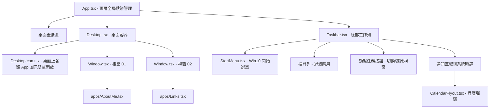

# Windows 10 現代風格互動式網站專案設計規劃書 (React + Vite + TS + Tailwind)

此專案旨在參考Windows10的內容與架構（如 Links 常用連結、About 關於我等），並將其老舊/復古風格重構為一個基於 **React + Vite + Tailwind CSS + TypeScript** 的 **Windows 10 模擬桌面系統**。

---

## 💻 1. 技術棧與系統架構 (Tech Stack & Architecture)

*   **框架核心**：[React 18] + [TypeScript] (提供穩定且型別安全的底層架構)
*   **建置工具**：[Vite] (極速的開發伺服器與緊湊的打包成果)
*   **樣式系統**：
    *   [Tailwind CSS] (快速排版、流暢響應式設計)
    *   **CSS 變數** (用以管理 Windows 10 主題顏色、工作列高度等)
    *   **毛玻璃特效 (Acrylic)**：使用 Tailwind 中的 `backdrop-blur-md` 或自訂 `backdrop-filter: blur(20px) saturate(125%)`
*   **圖示套件**：[Lucide React] (現代化、清晰的向量圖示) 與自訂 SVG

### 檔案目錄規劃：
```text
c:/Users/Asus TUF Gaming A17/Downloads/Test/
├── plans/
│   └── plan.md                   # 本設計規劃書
├── package.json                  # 專案依賴管理
├── vite.config.ts                # Vite 配置檔
├── tailwind.config.js            # Tailwind 配置檔
├── postcss.config.js             # PostCSS 配置
├── index.html                    # 進入點 HTML
├── src/
│   ├── main.tsx                  # 應用程式掛載點
│   ├── index.css                 # 全域樣式與 Tailwind 載入
│   ├── App.tsx                   # 桌面頂層核心
│   ├── types.ts                  # 全域型別定義 (如 WindowState)
│   ├── components/               # 再利用 UI 組件
│   │   ├── Desktop.tsx           # 桌面圖示與視窗容納容器
│   │   ├── DesktopIcon.tsx       # 桌面圖示元件
│   │   ├── Window.tsx            # 通用滑鼠拖動及縮放視窗 Chrome
│   │   ├── Taskbar.tsx           # 底部工作列 (包含時鐘與執行任務)
│   │   ├── StartMenu.tsx         # 開始功能表與右側動態磚 (Tiles)
│   │   └── CalendarFlyout.tsx    # 點擊時間彈出之日曆檢視面板
│   └── apps/                     # 個別模擬應用程式視窗內部內容
│       ├── AboutMe.tsx           # 關於我 (About)
│       ├── Links.tsx             # 移植自 maiware.cc/#links 之好友連結 (Badges)
│       ├── Projects.tsx          # 專案/作品集檢視器
│       ├── Logs.tsx              # 開發日誌 (Notepad 樣式)
│       └── Guestbook.tsx         # 互動留言板 (可將資料存入 LocalStorage)
```

---

## 🗂️ 2. 功能模組與實作細節

### A. 視窗管理狀態模型 ([src/types.ts](src/types.ts))
定義視窗狀態以維護開啟、縮放、焦點及座標位置：
```typescript
export interface WindowState {
  id: string;          // 視窗唯一標識符，如 'about', 'links', 'projects'
  title: string;       // 視窗標題
  isOpen: boolean;     // 是否開啟
  isMinimized: boolean;// 是否最小化
  isMaximized: boolean;// 是否最大化
  x: number;           // 視窗 X 軸座標
  y: number;           // 視窗 Y 軸座標
  width: number;       // 視窗寬度
  height: number;      // 視窗高度
  zIndex: number;      // 焦點層級深度
}
```

### B. 通用視窗外殼 (`Window.tsx`)
*   **Acrylic Header**：含有微軟特色的半透明標題列、應用程式圖示、以及最小化 (🗕)、最大化 (🗖)、關閉 (🗙) 按鈕。
*   **拖曳移動 (Drag Engine)**：利用 React 監聽鼠標 `onMouseDown`，動態更新該視窗的 `x` 與 `y`。為防止視窗被拉出螢幕之外，具有安全邊界碰撞限制。
*   **維度細部縮放 (Resize Engine)**：在視窗四周邊緣與四個角落設置 1~2px 寬度的絕對定位觸發區，滑鼠游標根據位置顯示對應的 `resize` 指針（如 `ns-resize`, `nwse-resize`），監聽滑鼠移動事件動態修改長寬。

### C. 開始功能表 (`StartMenu.tsx`) 與動態磚 (Live Tiles)
*   **左側快捷鍵**：點選可關閉選單、重啟模擬桌面、開啟「設定」應用程式等。
*   **中間 App 列表**：依英文字母或分類排列的 Windows 10 應用目錄。
*   **右側動態磚**：
    *   以 CSS Grid 佈局呈現 Win10 磁貼外觀。
    *   包含：[時間天氣]、[精選連結]、[作者頭像]、[Github 靜態圖框]、[X 連結] 動態磚。

### D. 內容移殖設計 (`Links.tsx`)
*   **現代化重塑**：
    *   保留原網站的像素徽章卡片群（保留經典情懷）。
    *   以現代 Web 元件方式重新排列：為每位好站加入毛玻璃卡片 Hover 放大的點擊卡，卡片包含連結原作者名稱、網址摘要以及酷炫的像素 logo。
    *   利用 Tailwind 刻畫高品質排版。

---

## 📈 3. UI 元件架構層級 (Mermaid Component Tree)



---

## 📅 4. 實作步驟規劃 (Todos)

1.  **專案初始化**：使用 `npm create vite` 初始化專案，安裝 `tailwindcss`, `postcss`, `autoprefixer`, `lucide-react`。配置 Tailwind 支援 Acrylic 半透明樣式。
2.  **型別與全域狀態建立**：在 `App.tsx` 建立全局視窗狀態陣列，並撰寫 `openWindow`, `closeWindow`, `minimizeWindow`, `toggleMaximize`, `focusWindow` 方法。
3.  **基礎佈局實作**：建立桌面背景、底部工作列與 Windows 10 風格的即時時鐘計算。
4.  **Window 核心開發**：實作可任意拖曳移動與邊界縮放的通用視窗組件，確保視窗點選時 `zIndex` 提升。
5.  **高解析度 UI 細節**：建立 Windows 10 開始按鈕、滑出式開始選單以及包含現代磁貼 (Live Tiles) 的區塊。
6.  **網頁分頁移植**：獨立開發五個主要應用程式內頁 (AboutMe, Links, Projects, Logs, Guestbook) 並嵌入通用視窗模組中：
    *   特別優化 `Links` 的視覺，將像素徽章以现代毛玻璃卡片框進行流暢重排。
    *   `Guestbook` 支援留言並儲存在 LocalStorage，做出完全能動態新增的互動實作！
7.  **自適應微調 (Mobile Support)**：添加觸控手勢相容，並在低解析度設備上默認以全螢幕或自適應大小開啟視窗，確保極佳的 UX 用戶體驗。
